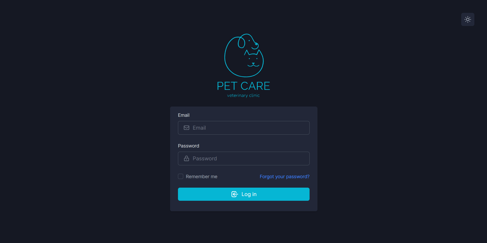
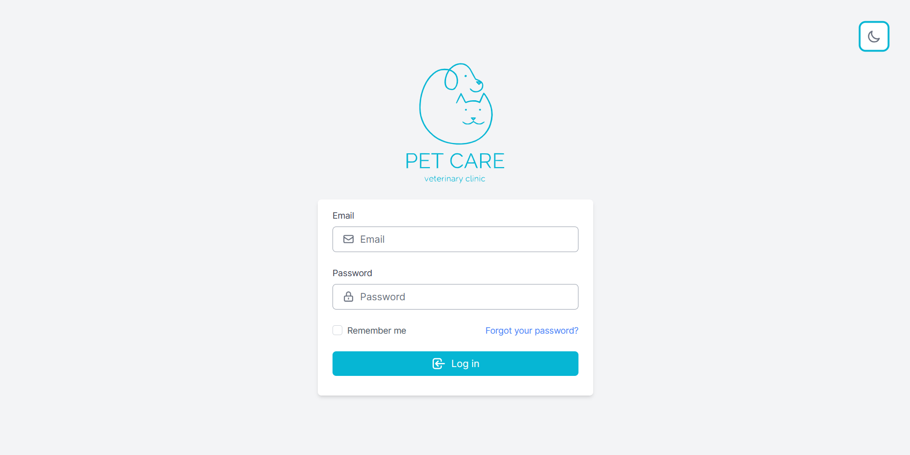
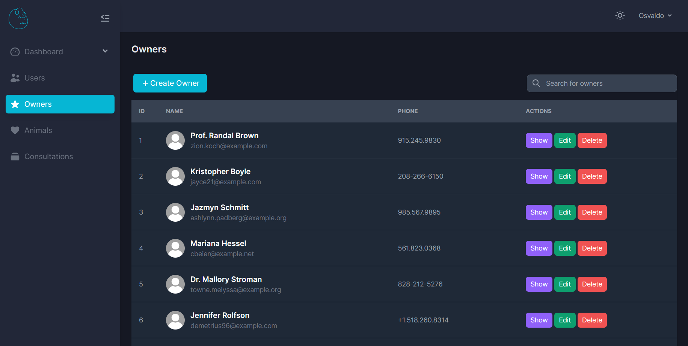
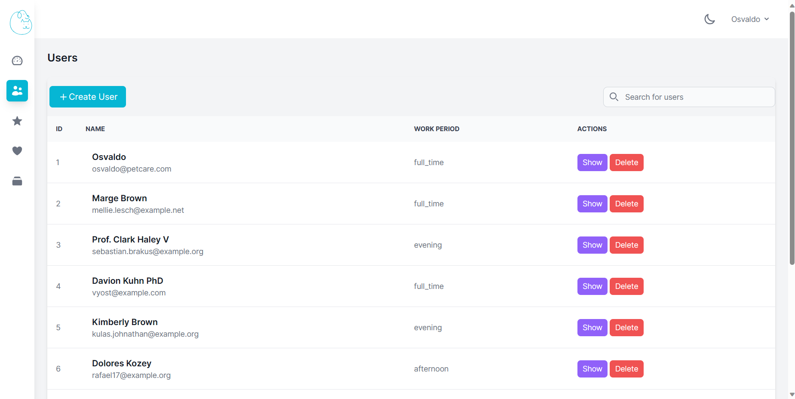
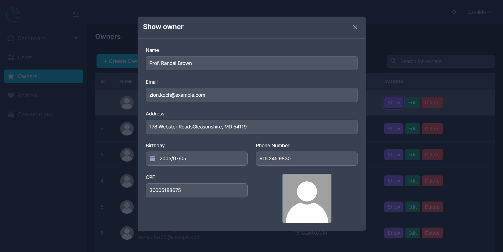
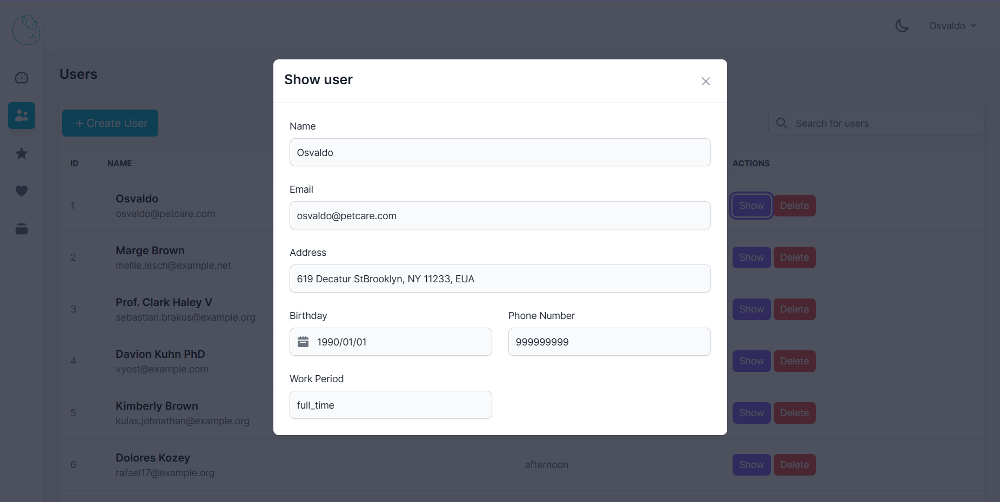
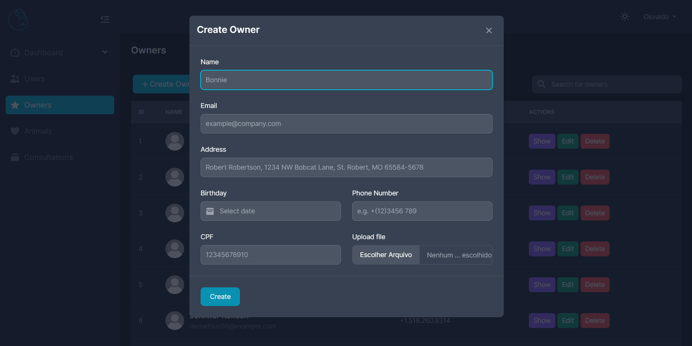
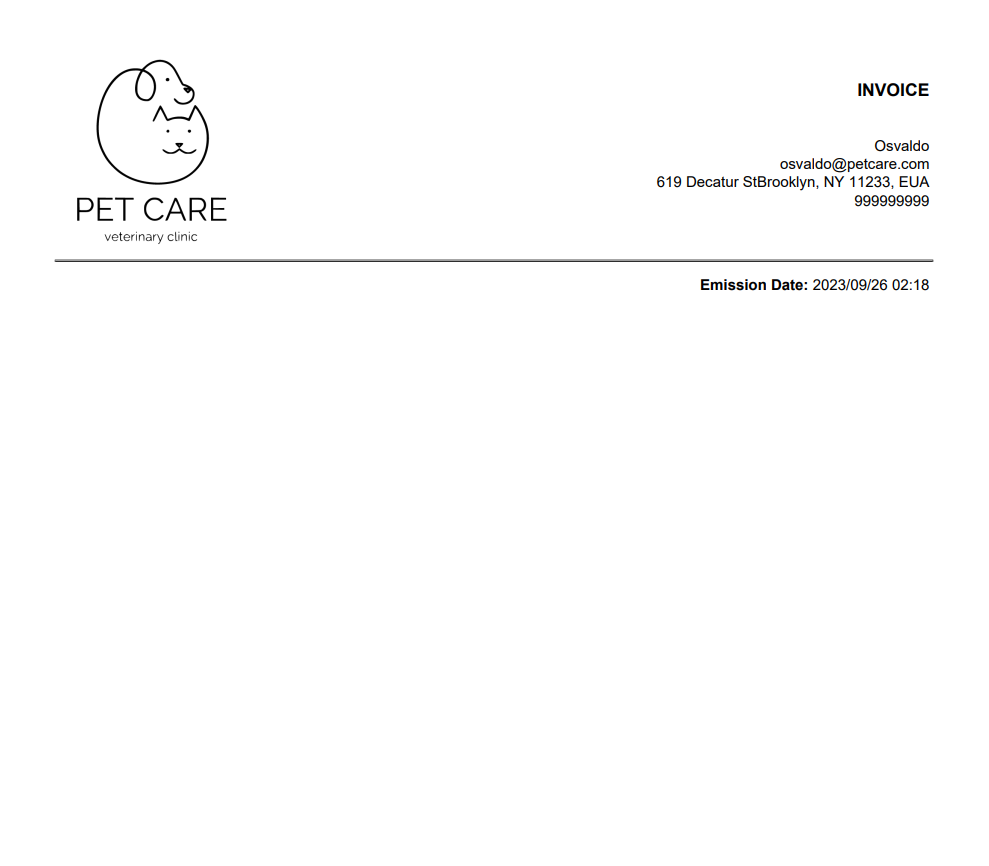

<p align="center"><a href="https://codejr.com.br/" target="_blank"></a></p>

<h1 align="center">
    Desafio Laravel 2023.2
</h1>

## Sobre o desafio

O desafio tem como intuito treinar os novos membros da Code Jr., afim de familiarizarem melhor com o framework desenvolvendo um sitema de gerenciamento interno de uma clínica veterinária, com as funcionalidades definidas no documento de requisitos disponibilizado.

## Como executar o projeto

Para executar o projeto você deve seguir os seguintes passos:

- Copie o arquivo `.env.example` e renomeie sua cópia para `.env`
- Crie um banco 'MySql' com o nome de `desafio_laravel_code`
- execute o comando: ```composer install```
- execute o comando: ```php artisan key:generate``` 
- execute o comando: ```npm install```
- execute o comando: ```npm run build```

Além dos comandos acima, você deve utilizar o comando ```php artisan migrate``` para criar as tabelas no banco de dados e ```php artisan db:seed``` para popular as tabelas com dados fictícios. Para rodar o projeto, execute o comando ```php artisan serve``` junto com o comando ```npm run watch```.

## Resultado

|                               |                               |
| ----------------------------- | ----------------------------- |
|         |       |
|   | |  |
|      | |
|      |  |

### Observações

O PDF atualiza de acordo com as consultas adicionadas ao banco.

